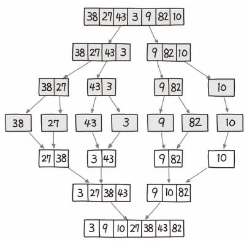

# 병합 정렬

정수형 배열이 있을 때 원소 개수가 1 또는 0이 될 때까지 리스트를 쪼개고, 쪼갠 순서의 역순으로 크기를 비교해 병합해 나가 최종적으로 정렬된 리스트를 얻을 수 있게 하는 정렬 방식.

### 예)


이 정렬 방식은 세 부분으로 나눌 수 있다.

### 분할(Divide)
- 입력 리스트를 같은 크기의 2개의 부분 리스트로 분할
### 정복(Conquer)
- 부분 리스트를 정렬
### 결합(combine)
- 정렬된 부분 리스트를 하나의 리스트에 통합

## 특징
1. 시간 복잡도가 O( N logN )이다.
    - 전체 리스트의 길이가 N일 때, logN번의 연산으로 리스트를 나눈다.
    - 원소의 개수마다 분리, 병합을 진행하므로 N번의 연산이 필요하다.

2. 공간 복잡도가 O( N )이다.
    - 리스트를 정렬하기 위해 원본 리스트와 같은 길이의 리스트를 만드므로 크기 N의 공간이 필요하다.

3. 데이터의 상태에 영향을 별로 받지 않는다.
    - 리스트에 같은 값을 가진 원소들이 있다고 할 때, 병합 정렬은 이 원소들의 순서를 바꾸지 않는다.
    - 이런 특성을 가진 정렬 알고리즘을 stable sort라고 한다.

## 코드
```
def merge_sort(arr):
    if len(arr) <= 1: # 쪼개진 배열의 크기가 1 이하면 반환
        return arr

    mid = len(arr) // 2
    left = arr[:mid] # 중간값을 사용해서 배열 쪼개기
    right = arr[mid:]

    left = merge_sort(left) # 재귀를 통해 반복
    right = merge_sort(right)

    return merge(left, right) # 반환된 리스트를 병합

def merge(left, right):
    result = [] # 결과를 저장할 리스트 생성
    i = 0 
    j = 0

    # 두 리스트를 비교해서 작은 값을 리스트에 추가
    while i < len(left) and j < len(right):
        if left[i] < right[j]:
            result.append(left[i])
            i += 1
        else:
            result.append(right[j])
            j += 1

    # 남은 요소들을 리스트에 추가
    while i < len(left):
        result.append(left[i])
        i += 1

    while j < len(right):
        result.append(right[j])
        j += 1

    return result
```